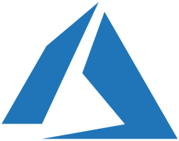
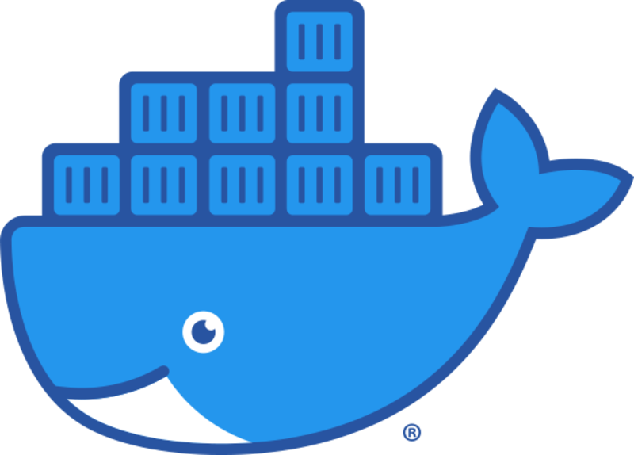
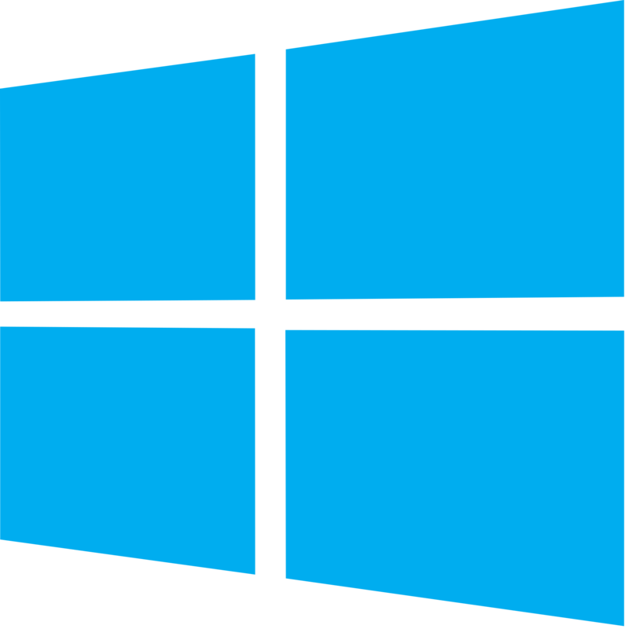
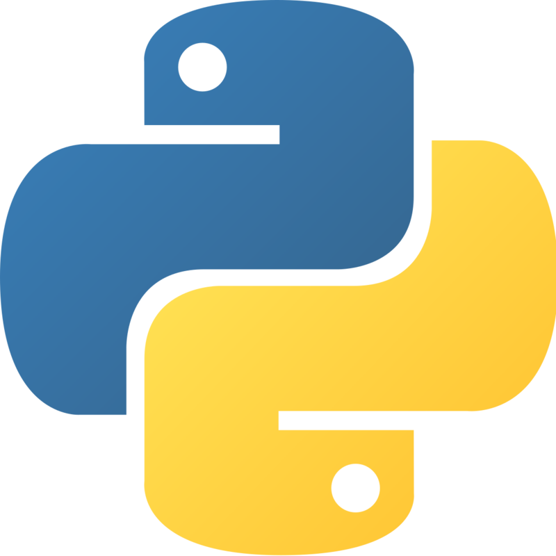
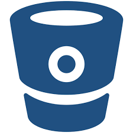
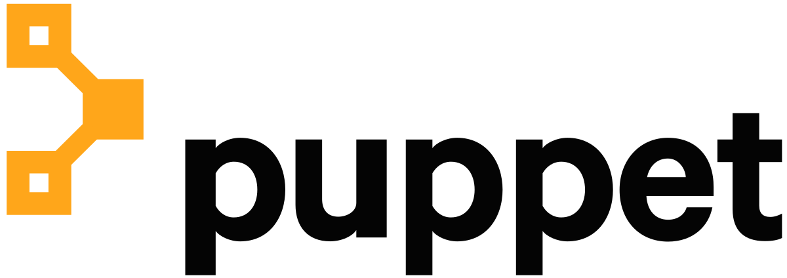

## Hi, my name is Quentin Tridon 👋
 

- :man_student:	I am currently in my last year of studies at **EPITECH Lille**, in a **Master of Architecture in System & Network Engineering**. 
- :medal_sports: I want to become an experienced **DevOps engineer** on all the technologies that are in this beautiful job. 
- :pushpin:	I would also like later to become a **cloud architect** and be able to create real infrastructures!
- :open_file_folder: I invite you to visit my **public repositories**, where you can see **all my projects**. Whether they are already developed, or under development. 
- :e-mail: **Many directories are private**, and if you want to **know more about me and these projects**, I invite you to **contact me by email or on linkedin!**
 

  <!-- Badge - Profile View Counter -->
   

  <!-- Badge - LinkedIn -->
  
  &nbsp;
  <!-- Badge - Email -->
  
 &nbsp;
 

 

  
 

 

## 👨🏻‍💻 Technologies

 Since the profession of devops requires to be good in multiple technologies and to know all the services of the providers. 
I invite you to consult the list of technologies that I am learning or that I master.

### **📚 Currently studying:**

&nbsp; &nbsp; &nbsp; &nbsp; &nbsp; &nbsp; &nbsp; &nbsp; &nbsp; &nbsp; &nbsp; &nbsp; &nbsp; &nbsp; &nbsp

### 🚀 I'm interested: 

&nbsp;  &nbsp;  &nbsp;  &nbsp;

As well as all these technologies and many others ...

## My Articles :

<a href=https://dev.to/arsn/how-to-quickly-easily-deploy-a-monitoring-tool-on-your-infrastructure-4ghf> How to quickly & easily deploy a monitoring tool on your infrastructure! </a>
