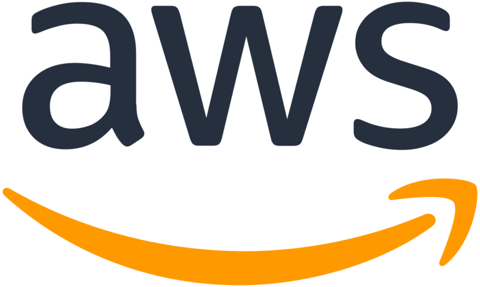
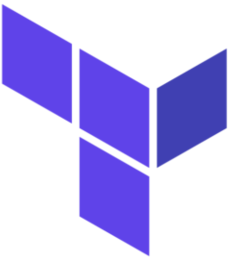

  <!-- Badge - Profile View Counter -->
   

  <!-- Badge - LinkedIn -->
  
  &nbsp;
  <!-- Badge - Email -->
  
 &nbsp;
 

 

  
 

## Hi, my name is Quentin Tridon 👋

- :man_student:	I am currently in my last year of studies at **EPITECH Lille**, in a **Master of Architecture in System & Network Engineering**. 
- :medal_sports: I want to become an experienced DevOps engineer on all the technologies that are in this beautiful job. 
- :pushpin:	I would also like later to become a cloud architect and be able to create real infrastructures!
- :open_file_folder: I invite you to visit my repositories, where you can see all my projects. Whether they are already developed, or under development. 
- :e-mail: Many directories are private, and if you want to know more about me and these projects, I invite you to contact me by email or on linkedin!

---

### 👨🏻‍💻 Technologies
**📚 Currently studying:**

  <!-- Figma Icon -->
  &nbsp;
  <!--AdobeXD Icon
  &nbsp; -->
  <!-- HTML Icon -->
  &nbsp;
  <!-- CSS Icon -->
  &nbsp;
  <!-- JS Icon -->
  &nbsp;
  <!-- AdobePS Icon
  &nbsp;-->
  <!-- Git Icon 
  &nbsp;-->
  <!-- Sass Icon -->
  &nbsp;
  <!--VueJS Icon-->
  &nbsp;
  <!--NuxtJS Icon-->
  &nbsp;
  <!-- React Icon -->
  &nbsp;
  <!-- NextJS Icon -->
  &nbsp;

