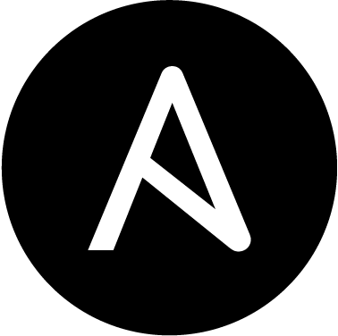

## Hi, my name is Quentin Tridon 👋
 

🍁 I currently live in Montreal, Canada.

👨‍🎓 Graduated from Epitech in 2022 with a master's degree in System and Network Engineering Architect.

🏅 My vocation is to become a complete DevOps Engineer, both on the developer part and on the ops part.

📌 I would also like to be able to design long-term cloud infrastructures (from network, to systems, to security).

📧 Many directories are private, and if you want to know more about me and these projects, I invite you to contact me.
 

  <!-- Badge - Profile View Counter -->
   

 

  
 

 

  
  &nbsp;
  
 &nbsp;
 

 

  
 &nbsp;
  
 &nbsp;
 

 
## 👨🏻‍💻 Technologies

 Since the profession of devops requires to be good in multiple technologies and to know all the services of the providers. 
I invite you to consult the list of technologies that I am learning or that I master.

### **📚 Currently studying:**

&nbsp; &nbsp; &nbsp; &nbsp; &nbsp; &nbsp; &nbsp; &nbsp; &nbsp; &nbsp; &nbsp; &nbsp; &nbsp; &nbsp; &nbsp

### 🚀 I'm interested: 

&nbsp;  &nbsp;  &nbsp;  &nbsp;

As well as all these technologies and many others ...

## My Articles :

<a href=https://dev.to/arsn/how-to-quickly-easily-deploy-a-monitoring-tool-on-your-infrastructure-4ghf> How to quickly & easily deploy a monitoring tool on your infrastructure! </a>
